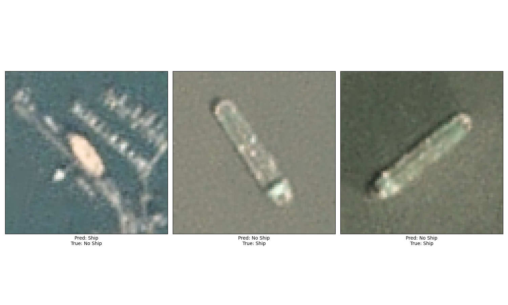

# Satellite Ship Image Classification

## Project Overview
This project focuses on the classification of ships in satellite imagery, utilizing a dataset of labeled satellite images of ships. The goal is to develop a deep learning model capable of accurately distinguishing images containing ships from those that do not. This task is crucial for various applications, including maritime navigation, port and maritime monitoring, and environmental studies.

## Dataset
The dataset used in this project is sourced from the Kaggle dataset ["Ships in Satellite Imagery"](https://www.kaggle.com/datasets/rhammell/ships-in-satellite-imagery) by Robert Hammell. It consists of 4000 satellite images sized 80x80 pixels, each labeled as either containing a ship (`1`) or not (`0`). The images are provided in RGB format, taken by satellite operators like DigitalGlobe and Airbus Defense & Space.

## Methodology

### Data Preprocessing
- **Normalization**: Pixel values were normalized to the range [-1, 1] to facilitate model training.
- **Splitting**: The dataset was split into training and testing sets to evaluate the model's performance on unseen data.

### Model Architecture
A Convolutional Neural Network (CNN) was employed for this binary classification task, featuring:
- Convolutional layers for feature extraction.
- Max pooling layers for dimensionality reduction.
- Dense layers for classification.

### Training
The model was trained using the Adam optimizer and binary cross-entropy loss function, over several epochs to minimize loss and improve accuracy.

## Results
The model achieved a high accuracy rate on the test set, indicating its effectiveness in classifying satellite images with and without ships. Specific metrics include:
- **Accuracy**: [0.96875]
- **Loss**: [0.0958]

## Visualization
Visualizations of the model's predictions were created to:
- Display a matrix of correctly classified images.
- Highlight specific cases of misclassifications, aiding in understanding model limitations and areas for improvement.

## Incorrect Predictions Visualization

Here are some examples of incorrect predictions made by the model:

## Conclusion and Future Work
The project demonstrates the potential of using CNNs for satellite image classification tasks. Future work may explore:
- Model optimization and hyperparameter tuning.
- Incorporating additional data and classes for multi-class classification.
- Implementing data augmentation techniques to improve model robustness.

## How to Use
[Instructions on how to set up, train, and evaluate the model. Include any requirements for libraries or tools.]

## Acknowledgments
Special thanks to Robert Hammell for providing the dataset on Kaggle, and to the various libraries and tools that facilitated this analysis, including TensorFlow, Keras, NumPy, and Matplotlib.
